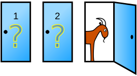

Terminal-Games
=================

This repo contains terminal python games which you can run and play.

Monty Hall Simulator
---------------

monty_hall_simulation.py is a simulation script to prove the winning "switch" hypothesys.
What it states is, it’s actually to your benefit to switch:
* If you switch, you have roughly a 2/3 chance of winning the car.
* If you stick to your original choice you have roughly a 1/3 chance of winning the car.

But how? [Bayes' theorem][0] can answer this question

 

## installation

* For Monty Hall Simulator
	* Install matpplotlib `pip install matplotlib`. Install GUI backend `sudo apt-get install python3-tk`
	* Run monty hall script `python monty_hall_simulation.py`

Modules Used
--------------
* [matplotlib][1] : Matplotlib is a comprehensive library for creating static, animated, and interactive visualizations in Python.
     
[0]: https://brilliant.org/wiki/bayes-theorem/
[1]: https://matplotlib.org/